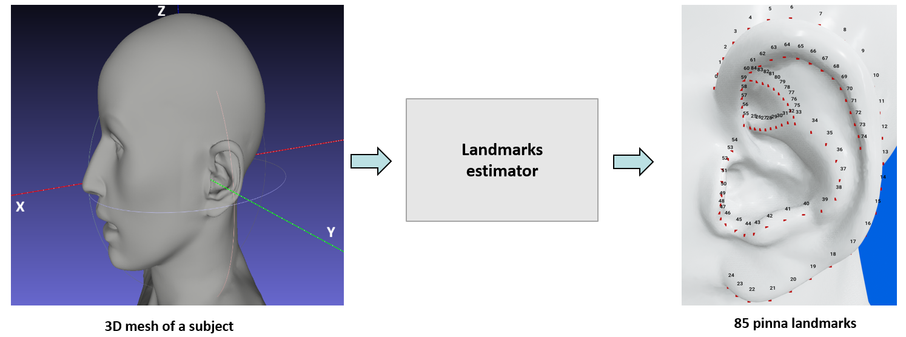
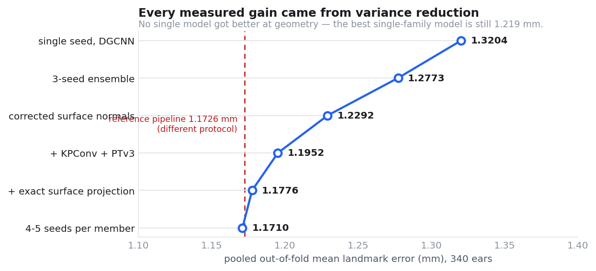
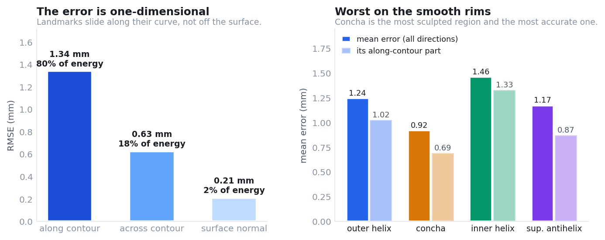
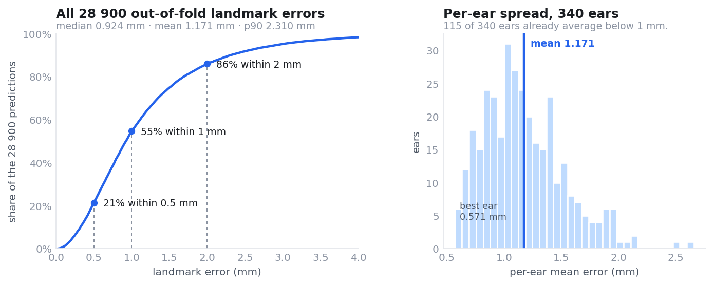
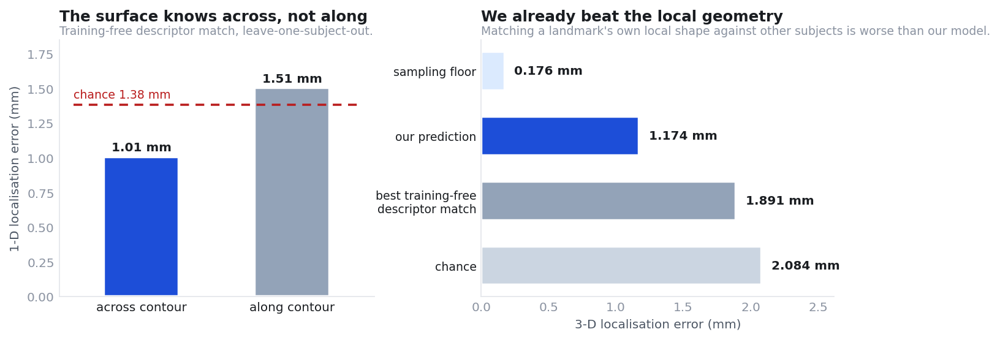
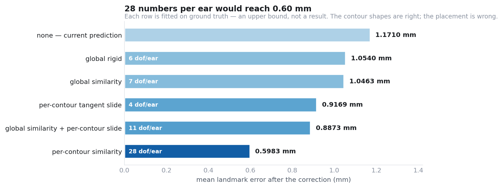

# Huawei Tech Arena 2026 — Pinna Landmark Extraction



Predict **85 ordered pinna landmarks per ear** from a raw 3-D head scan. The pipeline runs
**landmark-free at test time**: it detects the ear, initialises a shape prior, and refines
it with an ensemble of point-cloud networks.

---

## Result

**1.1710 mm** mean ordered landmark error, pooled **out-of-fold over all 340 development
ears** (170 subjects, 5 subject-grouped folds). The 30-subject lockbox has never been
touched — not for model selection, not for hyperparameters, not for ensemble weights.

| | |
| --- | ---: |
| Pooled out-of-fold MLE, 340 ears | **1.1710 mm** |
| Median landmark error | 0.931 mm |
| P90 | 2.332 mm |
| Within 1 mm / 2 mm | 54 % / 86 % |
| Best ear | 0.544 mm |
| Ears averaging below 1 mm | 116 of 340 |
| Fold-to-fold sd · seed-to-seed sd (DGCNN member) | 0.042 mm · 0.003 mm |

> **Target.** The organizers call **< 0.5 mm** good and **< 0.2 mm** very good, because
> these landmarks feed pinna measurements used for HRTFs. We are not there. What follows
> is the measured account of why, and of exactly what would close the gap.



Every one of those steps is a **paired** comparison on identical ears with a 20 000-draw
subject-level bootstrap. The honest reading is uncomfortable and worth stating plainly:
**no single model ever got better at geometry.** A single network is 1.268 mm and the best
seed-ensembled family is 1.229 mm; the whole −0.143 mm came from variance reduction
(seeds, cross-family diversity), one corrected input (surface normals), and one exact
output operation (point-to-triangle projection).

A comparison pipeline reports 1.1726 mm end-to-end on 30 unseen subjects. That is a
**different protocol** on a different split and is not a like-for-like number; it is drawn
above as a reference line, not as a ranking.

Two weighting rules score better still — **1.1699 mm** with nested-OOF nonnegative weights
over all seven model groups, and **1.1684 mm** when near-duplicate groups (signed-error
correlation ≥ 0.95) are merged first. Both have intervals excluding zero, and both involve a
choice the headline does not; five rules were compared, so the headline is deliberately the
one that selects nothing. See [`ensemble_all.json`](research/results/ensemble_all.json).

<details>
<summary><b>What the deployed submission scores, which is not the same thing</b></summary>

The torch-free estimator exported in `deep_model/` is the 4-seed DGCNN with TTA and
surface projection: **1.3144 mm** pooled OOF over the same 340 ears. The 1.1710 mm figure
is the research ensemble (DGCNN ×5 seeds + KPConv ×4 + PTv3 ×4), which has not yet been
exported to the NumPy inference path. Both numbers are measured under the same protocol;
they differ in which models are in the box.
</details>

---

## Evaluation protocol

Anything reported here is subject to the same rules, frozen before the experiments:

```
subject_group = ear_index // 2                # both ears of a subject share a fold
folds         = array_split(RandomState(12345).permutation(unique(subject_group)), 5)
```

* **Pooled out-of-fold**, never a single validation split — every one of the 340 ears is
  predicted by a model that never saw that subject.
* **≥ 3 seeds per fold** for any architecture claim; fold × seed variance is decomposed
  and reported (`research/results/multiseed_*.json`).
* **Paired subject-level bootstrap**, 20 000 draws, for every adopted change.
* **Nested grouped CV** for anything fitted on predictions (ensemble weights, profiles);
  the in-sample value is reported next to it only to size the optimism.
* **Lockbox untouched** until every architecture and ensemble rule is frozen.
* A change is adopted only if the paired CI excludes zero. Gains below ~0.01 mm are not
  claimed.

The exact fold file, the scripts, and the machine-readable aggregates are in
[`research/`](research/README.md).

---

## Architecture

```
raw head mesh (PLY)
   │
   ▼  classical stage — curvature-based ear detection, rigid ICP to a mean-ear
   │  template, SSM projection, GBR residual correction, KNN shape blending
   ▼
coarse 85 landmarks  (~3.7 mm)
   │
   ▼  canonical framing: crop ±14 mm around the coarse estimate, rotate to the SSM
   │  mean, centre on the coarse centroid, keep true mm scale. Right ears are
   │  mirrored into a common left frame — by flipping the winding and RECOMPUTING
   │  normals, not by negating them (this was a real bug; fixing it was worth −0.048 mm)
   ▼
┌──────────────────────────────────────────────────────────────────────────────┐
│  DGCNN ×5 seeds      2048 pts   EdgeConv k=20, offset→snap head ×4,   1.2185 │
│                                 per-contour 1-D refinement                    │
│  KPConv ×4 seeds     8192 pts   true fixed-radius neighbourhoods in mm 1.2335 │
│  PTv3   ×4 seeds     8192 pts   serialised patch attention             1.2185 │
└──────────────────────────────────────────────────────────────────────────────┘
   │  equal weight per group, plain seed mean within group — no fitting, no selection
   ▼  1.1761 mm
exact point-to-triangle surface projection
   ▼
1.1710 mm
```

Seeds are the reliable lever and they have not saturated: going from 7 networks to 13 in
this same structure moved 1.1776 → 1.1710 mm with a paired interval of [−0.0107, −0.0024].

The **offset→snap head** is the piece that matters. Each pass emits an unconstrained
displacement (so a landmark outside the initial window is still reachable — without it the
model plateaus at 2.76 mm), then re-windows and takes a softmax expectation over the K=48
nearest surface points. The result is a convex combination of real surface points, so the
prediction stays *on* the surface and is sub-point-spacing precise.

| | |
| --- | --- |
| Parameters | 813 k per DGCNN seed — deliberately small for 280 training ears |
| Loss | MSE on the output + deep supervision on every pass |
| Optimiser | AdamW, lr 1.5e-3, wd 5e-4, cosine, 1200 epochs, batch 16 |
| Augmentation | subsample, ±34° rotation, ±10 % scale, 0.25 mm surface jitter, 0.9 mm init jitter |
| Inference | pure NumPy, no PyTorch — parity-verified to 3.6e-6 against the torch reference |

---

## Where the error actually is



In an orthonormal per-landmark frame — along-contour, across-contour, surface normal —
**80 % of the error energy is a single direction**: landmarks sliding *along* their own
curve. The surface-normal component is 0.21 mm, i.e. the landmarks are essentially on the
right surface, at the right distance from the rim, in the wrong place along it.

Three measurements narrow that down further:

* **It is not a resolution problem.** Correlation between a landmark's error and the local
  vertex density is **−0.05**. Local *sharpness* helps the across-contour component
  (−0.14) and **hurts** the along-contour one (+0.15) — a ridge pins you across it and
  says nothing along it. Curvature channels, tighter crops and denser clouds all attack
  the 20 % that is not the problem.
* **It is not pointwise noise.** The along-contour error autocorrelates at **0.95–0.99 at
  lag 1**: each contour slides as a unit. A single constant shift accounts for 48 / 31 /
  59 / 76 % of each contour's along-contour energy.
* **It is not truncated context.** Minimum clearance from a landmark to the crop boundary
  is 12.3 mm; 7 of 28 900 landmarks fall outside.



### How much of a landmark is even in the local surface?

Every other number here is "a model reached X mm", which never says whether X is a
modelling failure or the information content of the surface. So we measured the surface
instead of another network: **training-free**, leave-one-**subject**-out, on the *native
undecimated* crop (~0.70 mm vertex spacing) resampled deterministically at 0.22 mm — a
multi-scale height-over-tangent-plane descriptor matched against 60 other subjects, with
nothing fitted and therefore nothing that can overfit. 120 ears, 10 200 landmarks.



* **Local geometry is already exhausted.** The best training-free match localises a
  landmark to 1.891 mm against a chance level of 2.084 mm. Our model, on the same ears,
  is at 1.174 mm — it is *already* extracting more than the local surface alone contains.
* **Along the contour, the surface says nothing.** Restricted to one direction, the
  matcher reaches 1.010 mm across the contour against a chance level of 1.384 (**0.73 ×
  chance** — real signal), and 1.509 mm along it against a chance level of 1.503
  (**1.00 × chance** — none at all). Chance differs by direction, so the two must be
  compared against their own baselines. Only 9 of 85 landmarks beat chance by 1.6 × along
  the contour, against 48 across it. This is an independent, training-free confirmation of
  the sharpness result above.
* **8 of 85 landmarks are geometrically determined** (all in the inner helix, indices
  67–74); **30 of 85** are not determined at all.
* **Where the surface is ambiguous, our model is wrong.** The matcher's own confusion
  predicts our per-landmark error at Spearman **ρ = 0.63** (p < 1e-6).
* Larger descriptor scales monotonically beat smaller ones (1.93 → 1.76 mm from 1.5 mm to
  6 mm radius), pointing the same way as everything else: the missing information is
  **non-local**.

These localisation errors are what *one* descriptor and *one* matcher achieve; they bound
nothing formally, and a learned metric or a context model can beat them — as ours already
does. The caveats are enumerated in
[`research/results/info_limit.json`](research/results/info_limit.json).

---

## What would close the gap



Each row is fitted **on ground truth** — these are oracles, i.e. upper bounds on what a
correction of that form could buy, not results. Read them as a measurement of *where the
information is missing*:

| correction | MLE | Δ | dof / ear |
| --- | ---: | ---: | ---: |
| none — current prediction | 1.1710 | — | 0 |
| global rigid | 1.0540 | −0.117 | 6 |
| global similarity | 1.0463 | −0.125 | 7 |
| per-contour tangent slide | 0.9169 | −0.254 | 4 |
| global similarity + per-contour slide | 0.8873 | −0.284 | 11 |
| **per-contour similarity** | **0.5983** | **−0.573** | 28 |

**Twenty-eight numbers per ear reach 0.60 mm.** The contour *shapes* are already
essentially correct; their *placement* is wrong. And the placement errors are structured,
not random: outer and inner helix slides correlate **+0.49**, concha and superior antihelix
**−0.51** (they share a boundary, so moving it pushes one forward and the other back), and
a subject's two ears **+0.30…+0.42**.

The wall is that **nothing has yet predicted any of it from the ear**. Ten independent
attempts return out-of-fold R² ≤ 0, including ridge and gradient boosting on the *full
255-coordinate predicted shape* — the strongest feature set available at test time.

### Why: the model is already calibrated

Two measurements taken together close off a whole class of fixes.

The prediction is **under-dispersed**. Over the 200 most rigid cross-contour landmark
pairs, the predicted separations vary *less* across ears than the ground-truth ones do:

| | median CV(pred) / CV(GT) | MLE |
| --- | ---: | ---: |
| KPConv, 1 seed | 0.920 | 1.2881 |
| PTv3, 1 seed | 0.904 | 1.2982 |
| 5-model ensemble | 0.879 | 1.1827 |
| + surface projection | 0.893 | 1.1776 |

If a prediction were truth-plus-noise this ratio would exceed 1. Below 1 is shrinkage; it
is present in every individual model and ensembling deepens it. So the model emits the
population-*typical* ear, and real ears deviate from it — which is exactly the 28 degrees
of freedom the oracle recovers.

That is also what an MSE-trained model *should* do when part of the target is
unpredictable: emit the conditional mean. The identity to check is
`var(pred_k) = ρ²_k · var(gt_k)`, i.e. the optimal per-mode gain is 1. Fitting those gains
out-of-fold on a fold-safe PCA basis of the training ears' shapes gives **1.000**, worth
+0.0002 mm (CI [−0.000, 0.0004]) — and per-mode, 1.00–1.02 for the modes the model
predicts well, dropping to 0.85 for the one mode it barely predicts (ρ² = 0.26). The
shrinkage is precisely calibrated.

**Consequence.** The remaining 0.575 mm is *conditional variance* given the information
the model currently uses. No architecture, no resolution, no ensemble and no rescaling of
the existing output can remove it. Only **new information** — which measurably means the
subject's other ear, whose slide correlates +0.30…+0.42 — or a **different target
parameterisation** can.

---

## Negative results

Recorded because they are the expensive part of the record, and because each one narrows
the search. All measured under the protocol above.

| experiment | result | verdict |
| --- | ---: | --- |
| 7 DGCNN variants (untied cascades, 4096 pts, multi-sample fusion, curve-Chamfer, …) | −0.05…+0.08 mm | all null or harmful |
| Fitted ensemble weights (16 granularities, nested CV) | +0.002 mm vs equal | indistinguishable |
| Dense-SSM hybrid blend, after the normals fix | +0.002 mm | retired |
| Family C — dense template correspondence | 1.83 mm | rejected |
| Family F — explicit curve + monotone phase | 1.81 mm | rejected, but see below |
| Deployable arc-length reparameterisation (k = 2…6 predicted anchors) | 1.195 → 1.273 mm | harmful at every k |
| 121-feature head/bilateral context probe | max OOF R² −0.015 | null |
| Ridge / GBM on the full predicted shape | max OOF R² −0.023 | null |
| 6 post-hoc residual correctors | OOF R² ≤ 0 | null |
| Slide inherited from the coarse initialiser | OOF R² −0.09 | null |
| Slides *solved* from cross-contour rigidity | 1.178 → 1.453 mm | harmful |
| Per-mode variance recalibration | +0.0002 mm | already calibrated |
| 12-channel multi-scale curvature input (probe) | +0.31 mm vs normals alone | rejected before GPU |
| Family B — native-mesh vertex heatmap output | 1.655 mm, overfits from epoch 20 | rejected |
| Family E — bilateral context, 5 folds × 3 seeds × 2 arms | +0.0052 mm, CI [−0.007, +0.017] | closed |
| Geometric-median aggregation / per-landmark offsets | +0.0035…+0.0076 mm | already calibrated |

Two of those deserve their footnote:

* **Family F's 1.81 mm did not refute the phase idea.** A reduced-rank curve carries a
  0.94–0.98 mm representation floor at 60 % dof, so we first blamed that — then falsified
  our own diagnosis, because raising the control-point count made it *worse*
  (1.810 → 1.856 → 1.888). The real cause was under-conditioning: the implementation
  regressed a whole contour from one pooled vector while the base model gets per-landmark
  local features. **The phase idea is still untested**; the clean experiment is the
  existing backbone with a monotone-phase head, one variable changed.
* **The arc-length profile is real but not exploitable yet.** For the inner helix and
  superior antihelix the landmark spacing is genuinely equidistant across subjects (gap CV
  0.018 / 0.012; a shared population profile leaves only 0.32 / 0.12 mm of phase
  uncertainty). Reparameterising between *predicted* anchors still loses, because the
  anchors themselves carry 1.0–2.5 mm of error and propagate it onto interior landmarks
  that were individually better placed.

---

## Reproducing

Every experiment reproduces from the private dataset placed at the path below; nothing
here depends on an artefact that is not either committed or rebuilt by a committed script.

```bash
pip install -r requirements.txt

python -m deep_model.evaluate_deep          # shipped model: metrics + figure, no PyTorch
python research/code/make_figures.py        # regenerate the figures in this README
```

The research programme — build order, exact commands, frozen folds, and machine-readable
aggregates for every number quoted above — is documented in
**[`research/README.md`](research/README.md)**.

```
├── src/                  classical stage + the official LandmarkExtractor submission class
├── deep_model/           exported torch-free inference (NumPy forward pass, weights, SSM)
├── research/
│   ├── code/             every experiment, one file per idea, docstring states the claim
│   └── results/          machine-readable aggregates + frozen fold assignments
├── img/                  figures used by this README (regenerated by make_figures.py)
├── docs/briefs/          the research mandate the programme was run under
└── versions/             source snapshot of the best classical pipeline (Dense V4)
```

<details>
<summary><b>Classical stage — Dense V4, 1.8738 mm</b></summary>

The coarse initialiser, and the best pipeline here before any deep model. Validation MLE
**1.8738 mm** over 30 subjects: median 1.7177, SR@2/3/5 mm = 65.5 / 84.1 / 95.9 %.

```
3-D head scan (PLY)
  → automatic ear detection      curvature analysis + learned spatial bounding box
                                 (ear regions carry 5.5× the skull's curvature)
  → coarse template alignment    rigid ICP of a mean left/right ear template
  → statistical shape model      GPA + PCA projection, regularises the shape
  → residual regression          255 gradient-boosting regressors on coordinate residuals
  → KNN shape blending           weighted blend with neighbours in shape-coefficient space
  → surface snapping             nearest point on the target mesh
```

[Source snapshot](versions/dense_v4_1.8738mm/) ·
[metrics](versions/dense_v4_1.8738mm/validation_metrics.json) ·
commit [`21bdc53`](https://github.com/yacine-baghli/EarWeGo/commit/21bdc53bb21ffbb8dcc0026108efcb014a025926)
</details>

<details>
<summary><b>Usage — training, evaluation, submission</b></summary>

Expected dataset layout:

```
2026 Munich Tech Arena - Datas/
└── 2026 Munich Tech Arena - Datas/
    ├── mesh/           P0001.ply …
    └── landmarks/      P0001_left_ear_landmarks.csv, P0001_right_ear_landmarks.csv …
```

```bash
python train.py    --mesh-dir "path/to/mesh" --landmarks-dir "path/to/landmarks"
python evaluate.py --mesh-dir "path/to/mesh" --landmarks-dir "path/to/landmarks"
```

`train.py`: `--n-components` (SSM PCA components, 30), `--k-neighbors` (7),
`--blend-alpha` (0.6), `--models-dir` (`models`), `--n-mesh-samples` (30).
`evaluate.py`: `--diagnostic` (full 6-D report + plots), `--quick-test N`, `--output-dir`.

The challenge platform loads `LandmarkExtractor` from `src/estimator.py`:

```python
extractor = LandmarkExtractor()
pred_left, pred_right = extractor.extract(mesh)
```

Ship `models/ear_detector.pkl` and `models/landmark_predictor.pkl` with the submission.
</details>

---

## Data policy

Published: source code, model weights (NumPy), configurations, frozen fold **indices**,
and aggregate statistics. **Not** published: challenge landmark coordinates, participant
split lists, host metadata, per-subject results. Every experiment is reproducible from the
private dataset because each script derives its inputs from the committed splits.
