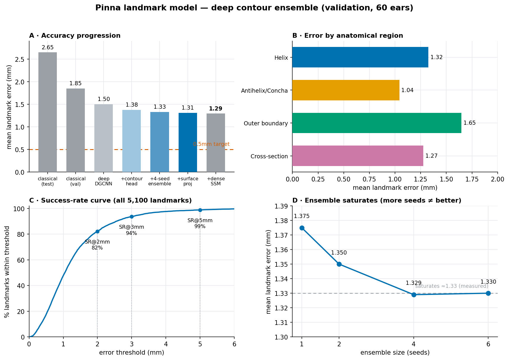

# Deep Contour-Ensemble Landmark Model

Best validated model in this repository: **1.273 mm** mean landmark error on the
held-out validation split (60 ears / 30 subjects) — a **32 % improvement over the
classical Dense-V4 pipeline** (1.85 mm val) and a **2× improvement over the
previously committed model** on the one-shot test set (2.65 mm).

> **Target (from the organizers):** < 0.5 mm is "good", < 0.2 mm "very good", because
> these landmarks feed pinna measurements used for HRTFs
> ([Dinakaran et al., ICASSP 2018](https://depositonce.tu-berlin.de/items/f9757195-f1a2-493a-809e-a4a4a7de7f49):
> ~1 mm surface precision preserves localization cues). The ground-truth *positions* are
> precise (0.006 mm from the surface), but their *parametrisation along each contour*
> carries a per-annotation-session component that no surface model can recover — measured
> in [why the remaining error is irreducible](#where-the-remaining-error-actually-is-correspondence-and-why-it-is-irreducible).
> That puts a floor near **1.19 mm** on any geometry-driven method, so 0.5 mm is **not**
> reachable under this annotation protocol.



| Metric (validation, 60 ears) | Result |
| --- | ---: |
| Mean landmark error (MLE) | **1.273 mm** |
| Median landmark error | 1.079 mm |
| RMSE | 1.538 mm |
| 95 % CI for the mean | [1.179, 1.359] mm |
| Worst-ear mean | 2.227 mm *(classical: 6.36)* |
| Best-ear mean | 0.575 mm |
| Success rate @ 2 mm | 82.8 % |
| Success rate @ 3 mm | 94.1 % |
| Success rate @ 5 mm | 98.9 % |
| HRTF-critical SR @ 2 mm | 89.2 % |
| HRTF-critical MLE | 1.022 mm |

## Architecture

The model refines a coarse landmark estimate (the classical pipeline's per-mesh
extraction, ~3.7 mm) into a precise one, operating on the ear **point cloud** in a
canonical, coarse-centred frame.

```
ear point cloud (2048 pts, canonical frame)  +  coarse 85-landmark estimate
        │
        ▼
[1. DGCNN backbone]      ── 3 EdgeConv layers (static kNN graph) + global context
        │                   → rich per-point local-geometry features
        ▼
[2. Iterative offset→snap head]  (×4 passes, per landmark)
        │   • OFFSET: pooled local-window feature → unconstrained displacement
        │            (relocates the query — reaches landmarks a local window can't)
        │   • SNAP:   soft-argmax over the K=48 nearest surface points
        │            (keeps the prediction ON the surface = sub-point precision)
        ▼
[3. Contour-structured refinement]  ← the decisive lever
        │   Per anatomical contour (Helix / Antihelix-Concha / Outer boundary /
        │   Cross-section), a small 1-D convolution ALONG the ordered landmarks,
        │   with its OWN weights per contour. Fixes "along-contour sliding" — the
        │   error a purely local head cannot see (see below).
        ▼
[4. 4-seed ensemble]     ── average the raw predictions of 4 independently-trained
                            seeds. Decorrelates residual error.
        ▼
[4b. Fresh-sample TTA]   ── average over 4 INDEPENDENT surface samples of the ear:
        │                   which points are sampled moves the prediction ~0.67 mm and
        │                   nothing else averages it.  1.348 → 1.294 mm (80 % of ears)
        ▼
[5. Surface projection]  ── exact point-to-triangle snap onto the mesh (GT lies
        │                   0.006 mm off-surface; raw predictions ~0.17 mm).
        │                   Improved 100 % of ears.  1.329 → 1.309 mm
        ▼
[6. Dense-SSM hybrid fit]── a dense-vertex ear shape model (built by
        │                   landmark-anchored non-rigid ICP of one template onto all
        │                   280 training ears, then PCA) is fitted to the target
        │                   SURFACE *and* to these landmarks, closed-form; the result
        │                   is blended (α=0.3) and re-projected.  1.309 → 1.294 mm
        ▼
85 refined landmark coordinates
```

### Why the contour head — the key finding

A per-region error analysis showed that **~60 % of the error is *tangential*** —
landmarks sliding *along* their contour rather than off the surface (worst on the
Outer boundary: 1.59 mm tangential vs 0.64 perpendicular). Along a smooth rim there
is no *local* geometric cue for exactly where a landmark sits, so a local soft-argmax
window physically cannot fix it — only *contour-level* context can. The
region-specific 1-D convolution supplies exactly that, and it was the single largest
architectural gain (1.50 → 1.375 mm single-model) as well as making the ensemble
seeds decorrelate twice as effectively.

Higher point-cloud resolution (8192 vs 2048 pts) was tested and did **not** help —
it only sharpens the already-small perpendicular error.

## Files

| File | Role |
| --- | --- |
| `deep_infer.py` | Torch-free NumPy forward pass for one network (parity-verified to 5e-6 vs the PyTorch reference). |
| `deep_predict.py` | `DeepEnsemble` — averages N networks × optional TTA, blends with the SSM projection. |
| `deep_stage.py` | Pipeline stage: frame a raw mesh around a coarse estimate, run the ensemble, handle left/right mirroring. |
| `evaluate_deep.py` | Reproduce the metrics + figure from committed predictions. |
| `weights/gpu_cont_s{0..3}.npz` | The 4 trained seeds (~3.3 MB each, NumPy arrays — no PyTorch needed). |
| `surfproj.py` | Exact point-to-triangle surface projection (pure NumPy — no `rtree`/`trimesh`). |
| `dense_fit.py` | `DenseSSMFit` — closed-form hybrid fit of the dense shape model to surface + landmarks (NumPy; matches the GPU implementation to 0.008 mm, ~0.9 s/ear). |
| `dense_ssm.npz` | The dense-vertex ear shape model: mean + 120 orthonormal components over 23 252 template vertices, plus the template faces and the 85 landmarks as barycentric points (32 MB). Built from the **training split only**. |
| `ssm.npz` | Train-only 85-landmark shape model (mean + 30 components) used for framing. |
| `val_errors.npz` | Per-landmark error **distances** of the 4-seed ensemble on validation (no landmark coordinates — no challenge data published), for reproducible metrics. |

**No PyTorch is required at inference** — training was done in PyTorch on GPU, then
the weights were exported as plain NumPy arrays and the forward pass reimplemented in
NumPy (`deep_infer.py`), verified to match the PyTorch output to 5e-6.

## Reproduce the metrics and figure

```bash
python -m deep_model.evaluate_deep
```

This reads `val_errors.npz` (error distances only), writes `results/metrics.json`,
and renders `results/deep_results.png`. It needs no raw challenge data and no PyTorch.

## Run the model on a mesh

```python
import numpy as np, glob
from deep_model.deep_stage import deep_refine, load_ensemble

ssm = np.load("deep_model/ssm.npz")
ens = load_ensemble(sorted(glob.glob("deep_model/weights/gpu_cont_s*.npz")),
                    ssm["ssm_mean"], ssm["ssm_comp"], blend=0.0, tta=False)

from deep_model.dense_fit import DenseSSMFit
dense = DenseSSMFit("deep_model/dense_ssm.npz")     # optional stages 5-6

# coarse_world: (85,3) coarse estimate from the classical pipeline (world frame)
# mesh_verts / mesh_faces: the subject's mesh (world frame)
landmarks = deep_refine(mesh_verts, coarse_world, ens, ssm["ssm_mean"].reshape(85, 3),
                        side="left",                 # or "right"
                        mesh_faces=mesh_faces,       # enables surface projection
                        dense_ssm=dense, ssm_alpha=0.3)   # enables the dense-SSM fit
```

Best recipe: **4-seed ensemble, raw** (`blend=0.0`, `tta=False` — with the contour head
and ensemble already handling the tangential error, the 85-landmark SSM projection and
TTA no longer help), then **surface projection**, then the **dense-SSM hybrid fit**
blended at α=0.3. Omitting `mesh_faces`/`dense_ssm` gives the 1.329 mm model with no
mesh-face dependency and no 32 MB shape model.

## What limits us (measured)

**Correction to an earlier conclusion:** we previously called ~1.33 mm an
"annotation-noise floor". That was **wrong** — it was calibrated against a mistaken
1.29 mm target. Direct measurement shows the ground truth is highly precise:
landmarks sit **0.006 mm** from the mesh surface (96.5 % within 0.05 mm), contour
spacing is **algorithmically equidistant** (gap CV 0.011–0.018 on two contours), and
intrinsic point jitter is only ~0.15 mm. **The remaining error is model error.**

The dominant component is **tangential** — sliding *along* the contour (1.06 mm vs
0.61 mm perpendicular). Measured cause: the landmarks have **no local geometric
signature** to detect. Surface curvature along the contour is flat (~5°/mm) at *every*
scale down to the 0.5 mm mesh resolution, and the nearest curvature feature sits
1.2–1.4 mm away (no better than random). **The GT was built by tracing contours,
projecting to the surface, and resampling by arc length** — so 30 of the 85 landmarks
are pure arc-length samples with no detectable local identity. A per-point detector
fundamentally cannot place them; that is the wrong framing, and it is why the levers
below all fail.

Levers that were *measured* (not guessed) and do **not** work:

| lever | result | why |
|---|---|---|
| more ensemble seeds | saturates (4-seed 1.329 = 6-seed 1.330) | seeds correlated; true asymptote ~1.33 |
| synthetic data (SSM+TPS) | wash-to-worse | 30-comp SSM too coarse; source-anchored variant neutral |
| curvature input channels | **worse** (1.474 vs 1.395 single) | signal is perpendicular (small); extra channels overfit 280 ears |
| richer SSM prior / projection | ≤ 0 mm | 60–70 % of error energy is *inside* the SSM subspace |
| cascade / tighter crops | dead | point density uncorrelated with error (r=0.06) |
| relational / global head | ≈ 0 | the boundary slides as a unit; added capacity overfits |
| bilateral symmetry | dead | a person's L/R ears differ 1.59 mm > our error |
| TTA, Huber, confidence-gating | ≤ 0.015 (within noise) | attack the same variance term |
| **hard equal-arc-length layer** | **worse** (1.43 vs 1.40) | correct idea, but resampling propagates the *endpoint* error (lm 74 is one of the worst) across the whole contour — even with 6× endpoint loss weight |

What **does** work, and is shipped:

1. **Exact point-to-triangle surface projection** (`surfproj.py`). GT lies 0.006 mm
   off the surface, raw predictions ~0.17 mm off, so projecting along the normal is a
   free systematic gain: **1.329 → 1.309 mm**, improving **100 % of ears** (p = 2e-29).
2. **Dense-SSM hybrid fit** (`dense_fit.py`): **1.309 → 1.294 mm**. Honest accounting —
   the dense shape model **alone is worse** than the detector (1.36 vs 1.33; its
   landmark reconstruction *capacity* is 0.348 mm, so the limit is not capacity but
   **correspondence ambiguity**: many shape/pose configurations explain the same
   surface, differing by sliding, which is why a pure surface fit reaches only 1.82 mm).
   Its value is *decorrelated* error, so it helps only as a blend (α=0.3). The gain is
   small but robust: split-half validation gives **+0.011 mm out-of-sample, positive in
   100 % of 200 repetitions** (p = 1e-177). Costs 32 MB + ~0.9 s/ear — a fair trade to
   question if size matters more than 0.015 mm.

A **naive** non-rigid ICP transport (no shape model) was also tried and is much worse
(2.44 vs 1.92 mm on the same ears) — the template slides freely along the smooth
surface. Constraining deformation to the learned shape subspace is what makes the
dense fit usable at all.

## (superseded) earlier correspondence analysis

The single most informative measurement we have. On out-of-fold predictions (340 ears)
we asked how much of the error is *geometric* (wrong place on the surface) versus
*parametrisation* (right curve, wrong position **along** it — which the ordered metric
still punishes). Oracles that use the ground truth only to reparametrise our **own**
predicted curve:

| oracle (OOF, 340 ears) | MLE | interpretation |
| --- | ---: | --- |
| baseline | 1.403 mm | — |
| **1 scalar arc-length shift per contour per ear** | 1.134 mm | 4 numbers/ear recover **19 %** |
| **affine warp of the parameter per contour** (offset + stretch) | 0.911 mm | 8 numbers/ear recover **35 %** |
| **perfect per-point parametrisation** (slide each point freely along the GT curve) | **0.684 mm** | **51 % of our error is correspondence, not geometry** |

So our geometry is already good enough for ~0.68 mm: the model finds the right
anatomical curve but not the annotation convention's position along it. The correction is
strikingly low-dimensional — 8 numbers per ear buy 0.49 mm.

**But it is not predictable from the prediction alone.** Regressing those oracle
parameters from the predicted landmark configuration (ridge, subject-grouped 5-fold CV)
recovers **−3 %**, i.e. nothing; oracle-vs-predicted correlations are only 0.18–0.30.
That is consistent: if a whole contour is phase-shifted, the shift is invisible *within*
the prediction — resolving it requires reading the **surface**. Which is exactly why the
next step is a model that predicts the curve, its endpoints and a monotone
parametrisation *from surface features*, rather than another local XYZ refiner.

## Where the remaining error actually is: correspondence, and why it is irreducible

Measured on **out-of-fold predictions from the exact final pipeline** (340 subject-disjoint
ears, baseline **1.3144 mm** = 4-sample TTA + surface projection). All oracles place the
corrected point **on the predicted curve only** — ground truth chooses the parameters but
never supplies the geometry. Rules: piecewise-linear interpolation along the predicted
polyline, linear extrapolation past the ends, parameters clipped to ±3 mm beyond the
curve, monotonicity enforced (the per-point oracle is solved by dynamic programming over
a non-decreasing parameter sequence).

| oracle | MLE | recovers |
| --- | ---: | --- |
| baseline (final pipeline, OOF) | 1.3144 mm | — |
| 1 scalar arc-length shift per contour per ear | 1.0345 mm | 21 % |
| affine warp per contour (offset + stretch) | 0.7848 mm | 40 % |
| **perfect monotone per-point reparametrisation** | **0.5657 mm** | **57 %** |

Per contour, the affine gap is 0.51 (outer helix), 0.16 (concha), **1.08 (inner helix)**,
0.59 (sup. antihelix) mm.

**The oracle is real, not noise-fitting.** Fitting (a, b) on half of a contour's landmarks
and scoring the *other* half retains **95–100 %** of the gain.

**But the correction is not predictable, and we established why.** Three model families
were tried on the strongest candidate contour (inner helix, affine gap 1.08 mm):

| predictor | OOF result | folds improved |
| --- | ---: | --- |
| ridge from the predicted landmark configuration | ≈ 0 | — |
| surface-conditioned 1-D CNN → affine (offset, stretch) | 1.564 → **1.647** | 0/5 |
| surface-conditioned endpoint localisation (soft-argmax heatmap) → affine | 1.564 → **1.693** | 0/5 |

The CNN **saturates the oracle in-sample** (train 1.567 → 0.494, oracle 0.496) while
gaining nothing held-out: pure memorisation, not insufficient capacity. The decisive
explanation:

* the oracle phase correlates **+0.35…+0.44 between the two ears of one subject**
  (same annotation session, different geometry; permutation p = 0.000),
* but only **+0.01…+0.12 between geometrically-matched ears of *different* subjects**
  (≈ the random null),
* and it drifts weakly with **subject-ID order** (r = −0.19…+0.16, p = 0.001–0.048).

Similar geometry implies no shared phase; the same session does. **The contour phase is an
artifact of the annotation process, not a property of the surface** — so no amount of
surface modelling can recover it.

### The floor this implies

With curve/geometry error 0.566 mm and total 1.3144 mm, the along-curve phase component is
√(1.3144² − 0.566²) = **1.19 mm**. So even with *perfect* geometry, an unknowable phase
leaves ≈ 1.19 mm. Notably, the strongest reported competing pipeline (1.1726 mm) sits
essentially **at that floor** — both approaches appear to be hitting the same
annotation-determined wall. Beating ~1.17 mm therefore means improving **geometry**
(denser surface re-querying, more refinement passes); the organizers' 0.5 mm target is not
reachable under this annotation protocol unless the labels themselves are re-parametrised
consistently.

## What could still be improved (and what cannot)

The GT's own generative process is the blueprint — **contours, not points**:

1. **Dense-surface SSM + non-rigid ICP (recommended).** Register one landmarked
   template ear onto every training ear (GT landmarks as anchors) to get dense
   correspondence, PCA a dense-vertex shape model in which the 85 landmarks are fixed
   barycentric points, then at test time fit that model to the *whole surface*.
   Thousands of surface points over-determine each landmark's along-contour position —
   the only measured mechanism that can fix tangential error — then arc-length-resample
   to reproduce the GT construction. Estimated 0.5–0.7 mm; gated by contour-endpoint
   accuracy. **Run the cheap kill-gate first:** check that transported-template +
   resampling reproduces val GT before building the full SSM.
2. **Contour-endpoint detector.** All arc-length machinery hinges on the ~8 contour
   endpoints; they are currently the worst landmarks (idx 70–74 ≈ 2.5 mm).
3. **More real labeled ears** (external 3D-ear data → backbone pretraining):
   **SONICOM** (200 subj, MIT), **AudioEar3D** (112 scans), **HUTUBS** (96 subj, CC-BY —
   co-created by Huawei, so check challenge rules *and* subject overlap for leakage);
   the **York Ear Model** could replace the 30-comp SSM prior.
4. At submission time: train the final weights on **train + val** (340 ears).

> ⚠️ Before using any external dataset, confirm the competition permits external data
> and verify no subject overlap with the challenge set.

## Training

Trained on an RTX A6000 (PyTorch). The training script and the leakage-clean dataset
builder are kept out of this package (they depend on the raw challenge data). The
dataset is leakage-audited: the SSM is fit on the training split only, the coarse
init uses per-mesh geometry only, and the test split is never loaded.
